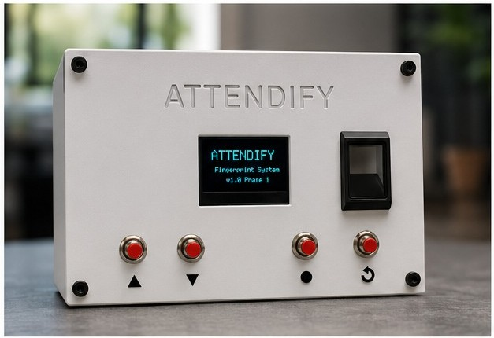
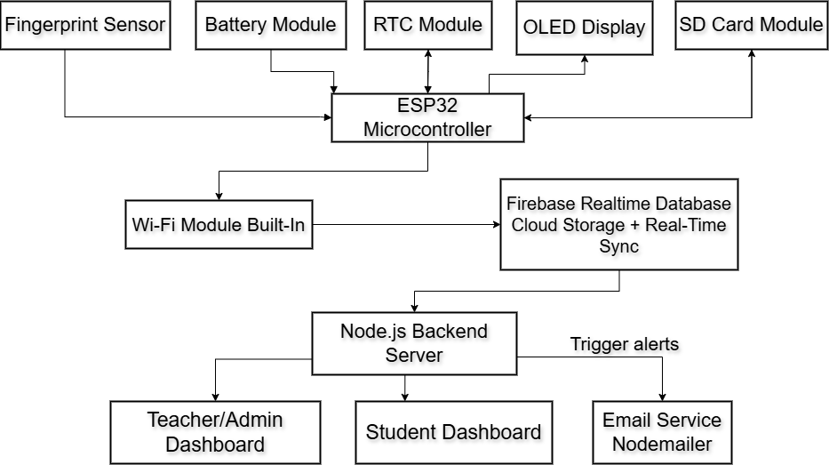
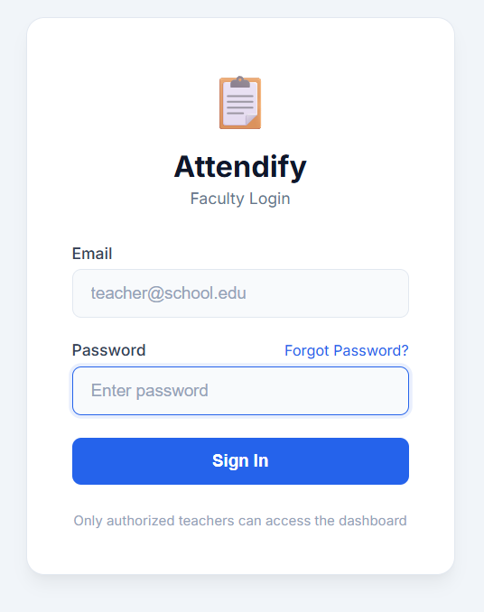
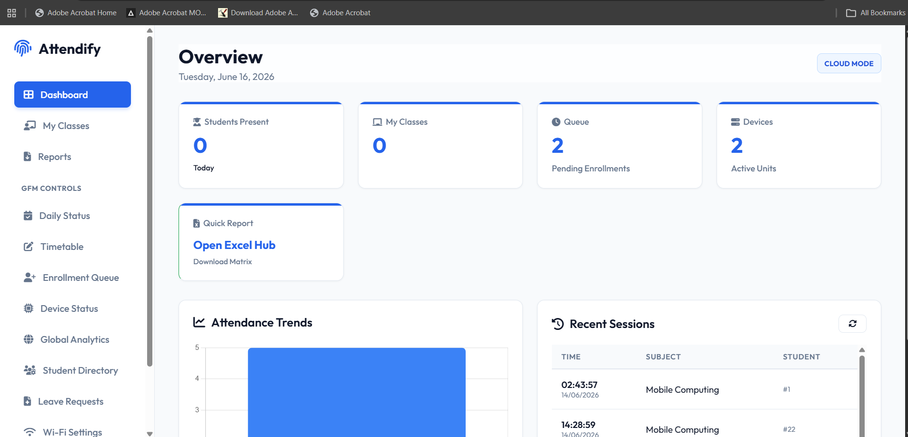
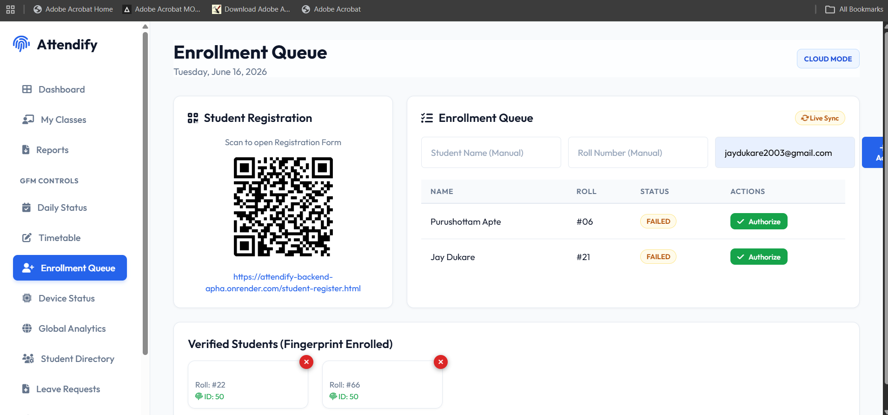
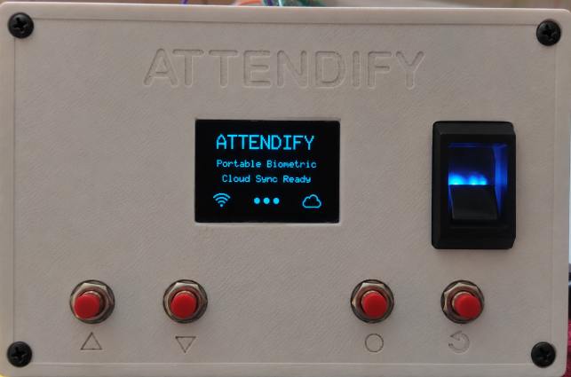

<div align="center">

# 📡 Attendify

### ✨ Next-Generation IoT-Based Biometric Attendance System using ESP32, Fingerprint Authentication, Firebase & Web Dashboard

<p>
  
  
  
  
  
</p>

<p>
  <a href="https://attendify-backend-apha.onrender.com/home.html">
    
  </a>

  <a href="https://youtu.be/EVmmJ_ZsfPY?feature=shared">
    
  </a>

  <a href="https://portfolio-zeta-murex-cawoef54bd.vercel.app/">
    
  </a>
</p>

</div>

---

## 📸 Device Showcase

A working prototype of the Attendify portable biometric attendance device developed as part of the final-year engineering project.

<p align="center">
  
</p>

A fully functional ESP32-based biometric attendance device with cloud synchronization and a web dashboard.

---

# 📖 Overview

Attendify is a **Next-Generation IoT-Based Biometric Attendance System** developed as a Final Year B.E. Electronics & Telecommunication Engineering project.

The system combines an **ESP32-based embedded device**, **R307 fingerprint authentication**, **Firebase cloud services**, and a **browser-based dashboard** to automate attendance management in educational institutions.

Unlike conventional biometric attendance systems, Attendify supports **offline-first operation** using an RTC module and MicroSD card, ensuring attendance can be recorded even without an internet connection. Once connectivity is restored, the device automatically synchronizes attendance records with the cloud.

The project demonstrates the integration of **Embedded Systems**, **IoT**, **Cloud Computing**, and **Full-Stack Web Development** into a single portable attendance solution.

---

# ✨ Key Features

- 🔐 Secure biometric authentication using the **R307 Fingerprint Sensor**
- 📡 ESP32-based IoT device with Wi-Fi connectivity
- ☁️ Firebase Authentication & Realtime Database integration
- 📱 Web dashboard for **Admin, Teacher, GFM, and Student**
- 📶 Offline attendance logging using **RTC (DS3231)** and **MicroSD**
- 🔄 Automatic cloud synchronization after reconnecting to Wi-Fi
- 👨‍🏫 Teacher-controlled attendance sessions
- 📊 Attendance history and report management
- 🔋 Rechargeable battery-powered portable device
- 🖥️ Custom-designed 3D enclosure and user-friendly interface

---

# 🏗️ System Architecture

Attendify consists of two major components that work together to provide a secure and reliable biometric attendance solution.

## 🔹 Firmware (ESP32)

The embedded firmware is developed using **PlatformIO** and runs on the ESP32 microcontroller.

### Responsibilities

- Fingerprint authentication
- OLED user interface
- Wi-Fi communication
- RTC-based timestamping
- SD card attendance logging
- Teacher & Student authentication
- Device configuration
- Cloud synchronization

---

## 🔹 Software

The software stack provides cloud services and a browser-based dashboard.

### Components

- **Backend:** Node.js & Express.js
- **Frontend:** HTML, CSS & JavaScript
- **Database:** Firebase Realtime Database
- **Authentication:** Firebase Authentication

The dashboard allows administrators, teachers, and students to securely access attendance records, manage users, and configure devices.

---

<p align="center">
  
</p>

# 🛠️ Hardware Used

| Component | Description |
|-----------|-------------|
| ESP32 | Main microcontroller with Wi-Fi connectivity |
| R307 Fingerprint Sensor | Biometric authentication |
| SH1106 OLED Display | User interface |
| DS3231 RTC Module | Offline timekeeping |
| MicroSD Card Module | Local attendance storage |
| Push Buttons | Navigation & configuration |
| Li-ion Battery | Portable power supply |
| Custom 3D Enclosure | Compact handheld device |

---

# 💻 Software & Technologies

| Category | Technologies |
|----------|--------------|
| Embedded Firmware | C++, PlatformIO, ESP32 |
| Backend | Node.js, Express.js |
| Frontend | HTML5, CSS3, JavaScript |
| Database | Firebase Realtime Database |
| Authentication | Firebase Authentication |
| Cloud Deployment | Render |
| Version Control | Git & GitHub |

---

# 📂 Project Structure

```text
📦 Attendify-IoT-Biometric-Attendance-System
│
├── 📂 firmware
│   ├── src
│   └── platformio.ini
│
├── 📂 software
│   ├── backend
│   ├── frontend
│   └── package.json
│
├── 📂 docs
│   ├── Attendify_Project_Report.pdf
│   ├── Block-Diagram.png
│   ├── Circuit-Diagram.png
│   └── System-Architecture.png
│
├── 📂 images
│   ├── Dashboard Images
│   └── Device Renders
│
├── 📄 README.md
├── 📄 render.yaml
└── 📄 .gitignore
```

---

# 📸 Visual Showcase

## 🖥️ Web Dashboard

The web dashboard enables administrators, teachers, GFM coordinators, and students to securely manage attendance records, monitor lectures, and configure devices.

<h3 align="center">🔐 Faculty Login</h3>

<p align="center">
  
</p>

<h3 align="center">📊 Dashboard Overview</h3>

<p align="center">
  
</p>

<h3 align="center">📝 Enrollment Queue</h3>

<p align="center">
  
</p>

---

## 📱 Portable Biometric Device

The Attendify device is designed as a compact handheld attendance system featuring fingerprint authentication, OLED display, Wi-Fi connectivity, offline attendance storage, and cloud synchronization.

### 📷 Device Overview

<p align="center">
  
</p>

### 🔧 Internal Hardware Design

<p align="center">
  
</p>

### 👆 Fingerprint Enrollment

<p align="center">
  
</p>

## 📟 Embedded Firmware

### 👨‍🏫 Admin Menu

<p align="center">
  
</p>

### 👩‍🏫 Teacher Menu

<p align="center">
  
</p>

# 📄 Documentation

The project documentation included in this repository provides additional technical details.

- 📘 **Project Report:** [Attendify_Project_Report.pdf](docs/Attendify_Project_Report.pdf)
- 🧩 **Hardware Block Diagram:** [Block-Diagram.png](docs/Block-Diagram.png)
- 🔌 **Circuit Diagram:** [Circuit-Diagram.png](docs/Circuit-Diagram.png)
- 🏗️ **System Architecture:** [System-Architecture.png](docs/System-Architecture.png)

All project documentation is available in the **docs**/directory.

---

# 🚀 Getting Started

## Prerequisites

Before running the project, make sure you have:

- ESP32 Development Board
- PlatformIO (VS Code Extension)
- Node.js (v18 or later)
- Firebase Project
- Git

---

## Clone the Repository

```bash
git clone https://github.com/Purushottam-13/Attendify-IoT-Biometric-Attendance-System.git
cd Attendify-IoT-Biometric-Attendance-System
```

---

## Firmware Setup

1. Open the **firmware** folder in Visual Studio Code.
2. Install the PlatformIO extension.
3. Configure Wi-Fi credentials and required settings.
4. Build and upload the firmware to the ESP32.

---

## Software Setup

Install the dependencies.

```bash
cd software
npm install
```

Create your environment file.

```text
software/.env
```

using the provided

```text
software/.env.example
```

Run the backend.

```bash
npm start
```

Open the frontend in your browser after the backend starts successfully.

---

# 🌐 Live Demo

**Live Application**

https://attendify-backend-apha.onrender.com/home.html

---

# 🎥 Demonstration Video

Watch the complete project demonstration here:

https://youtu.be/EVmmJ_ZsfPY?feature=shared

---

# 🚀 Future Improvements

The following enhancements are planned for future versions of Attendify:

- 📱 Mobile application for attendance monitoring
- 📊 Advanced analytics and attendance insights
- 📧 Automated email and notification system
- 📄 PDF and Excel attendance report generation
- 🔐 Multi-factor authentication for administrators
- ☁️ Support for additional cloud platforms
- 🎓 Integration with Learning Management Systems (LMS)
- 📈 Real-time attendance statistics and dashboards

---

# 👨‍💻 Author

**Purushottam Apte**

Final Year B.E. Electronics & Telecommunication Engineering  
PES Modern College of Engineering, Pune

📧 **Email:** aptepuru19@gmail.com

💻 **GitHub:**  
https://github.com/Purushottam-13

💼 **LinkedIn:**  
https://www.linkedin.com/in/purushottam-apte/

🌐 **Portfolio:**  
https://portfolio-zeta-murex-cawoef54bd.vercel.app/

---

# 🤝 Project Information

This repository showcases my contribution to the **Attendify – Next-Generation IoT-Based Biometric Attendance System**, developed as a Final Year B.E. Electronics & Telecommunication Engineering team project.

### Team Members

- Purushottam Apte
- Jay Ganesh Dukare
- Ojas Vijay Hadgal

---

# 📜 License

This project is shared for **educational and portfolio purposes**.

You are welcome to explore the repository and learn from the implementation.

If you reuse or modify this work, please provide appropriate attribution to the original authors.

---