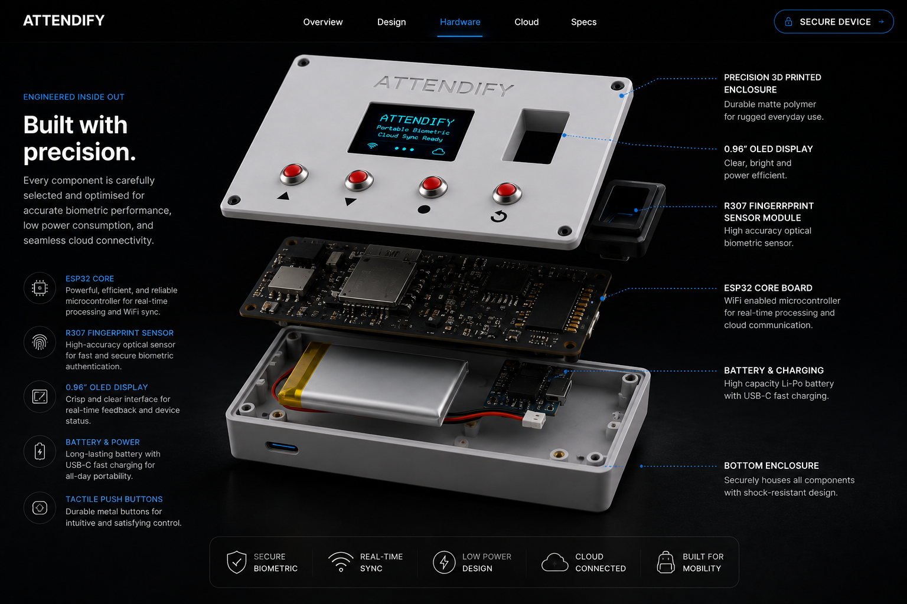
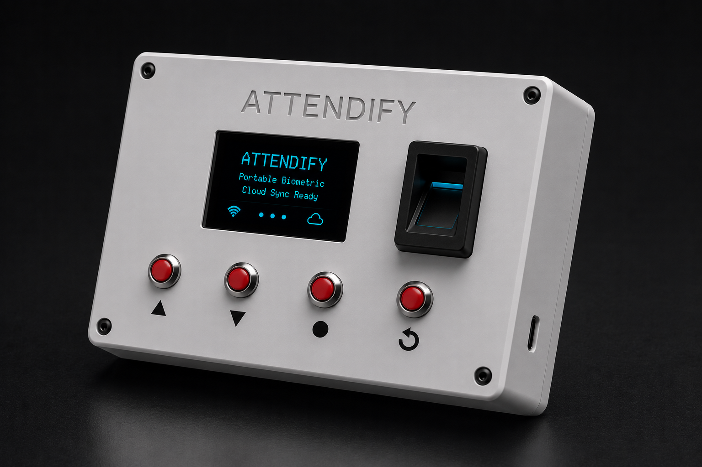
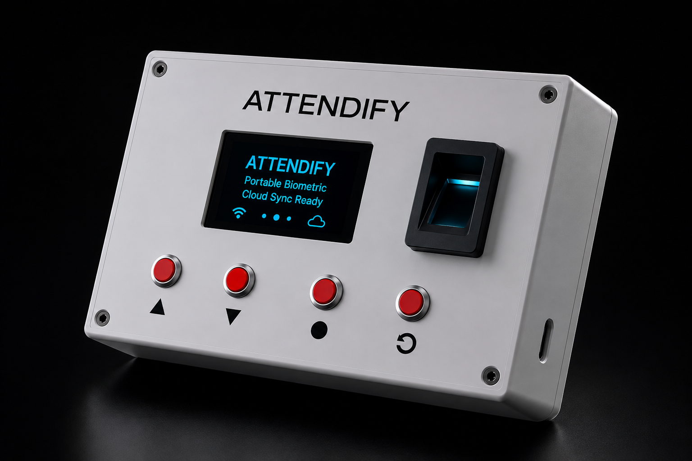
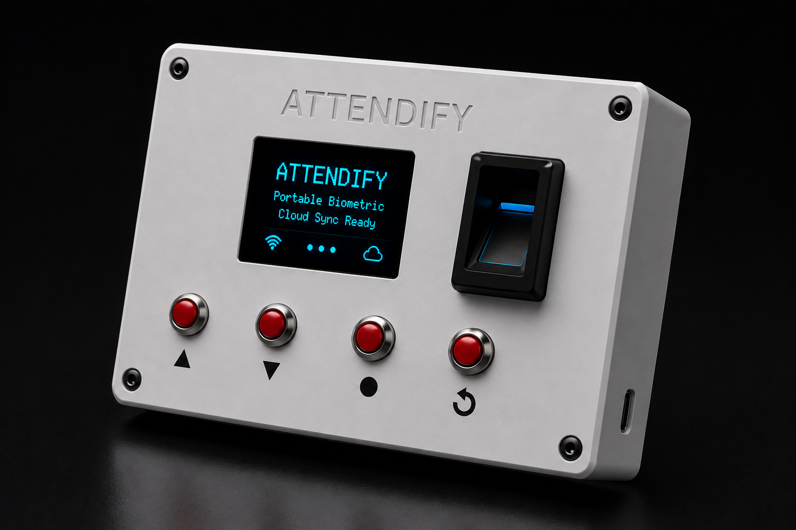
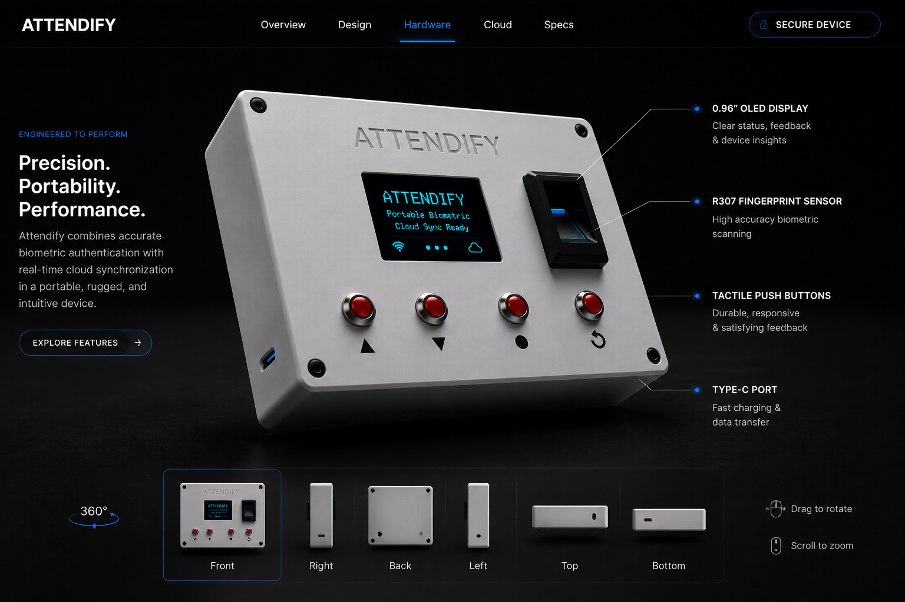

<div align="center">
  <h1>✨ Attendify</h1>
  <p><strong>A Next-Generation Biometric Attendance System (IoT + Full Stack)</strong></p>

  <!-- Badges -->
  
  
  
  
</div>

<br />

<!-- Hero Image -->
<p align="center">
  
</p>

---

## 📖 Overview

**Attendify** is a comprehensive, end-to-end biometric attendance solution designed for schools and educational institutions. By bridging the gap between custom **IoT hardware** and a **modern web backend**, Attendify offers a robust, secure, and user-friendly platform for managing student attendance. 

Unlike traditional software-only solutions, this project demonstrates full-stack capabilities, ranging from low-level C++ embedded systems programming to high-level asynchronous JavaScript web development.

---

## 🎨 Visual Showcase & Screenshots

### 🖥️ Responsive Web Dashboard
The web application provides an intuitive interface tailored for administrators, teachers, and students to track attendance metrics and manage system preferences in real time.

<p align="center">
  <kbd>
    
  </kbd>
  <kbd>
    
  </kbd>
  <kbd>
    
  </kbd>
</p>

### 🛠️ Hardware & Biometric Device IoT Renders
The hardware device integrates biometrics with offline fallback safety, packaged inside a custom-designed 3D-printed enclosure.

<p align="center">
  <kbd>
    
  </kbd>
  <kbd>
    
  </kbd>
  <kbd>
    
  </kbd>
  <kbd>
    
  </kbd>
</p>

---

## 🚀 Key Features

* **Biometric Authentication:** Uses the R307 fingerprint sensor for reliable, foolproof student identification.
* **Offline-First Hardware:** The ESP32 device operates flawlessly offline using an onboard RTC (DS3231) and MicroSD card, syncing data to the cloud automatically when Wi-Fi is available.
* **Real-time Web Dashboard:** A sleek web interface built for Admins, Teachers, and Students to monitor attendance records, manage devices, and generate reports.
* **Role-Based Access Control (RBAC):** Secure authentication flows supporting multiple user tiers (Admin, Teacher, GFM, Student).
* **Cloud Integration:** Leverages Firebase for real-time data sync and authentication, with local JSON storage fallback.

---

## 🏗️ System Architecture

The project is split into two primary domains, demonstrating a clear separation of concerns:

### 1. Embedded Systems (`attendify-hardware2/`)
* **Microcontroller:** ESP32 handling Wi-Fi connectivity and asynchronous tasks.
* **Peripherals:** 
  * **R307** Fingerprint Sensor for biometrics.
  * **SH1106 OLED** Display for a local user interface.
  * **DS3231 RTC** for accurate offline timekeeping.
  * **MicroSD Module** for local data logging.
* **Firmware:** Developed in C++ using the PlatformIO ecosystem, featuring a custom state machine for the local setup flow and UI.

### 2. Web Application (`attendify-software2/`)
* **Backend API:** Built with Node.js and Express. Handles complex routing, data validation, and communication with the hardware endpoints.
* **Database & Auth:** Integrates Firebase Admin SDK for robust cloud storage and user authentication.
* **Frontend:** Responsive dashboard created with HTML, CSS, and Vanilla JavaScript, ensuring lightweight and fast client-side performance.

---

## 💻 Technology Stack

| Category | Technologies |
| :--- | :--- |
| **Embedded / IoT** | C++, PlatformIO, Arduino Framework, ESP32 |
| **Backend** | Node.js, Express.js, RESTful APIs |
| **Database & Auth** | Firebase Realtime Database, Firebase Authentication |
| **Frontend** | HTML5, CSS3, JavaScript (ES6+), Webpack |
| **Tools & DevOps** | Git, GitHub, VS Code, Postman |

---

## ⚙️ Quick Start

### Hardware Setup
1. Navigate to the `attendify-hardware2/` directory.
2. Open the project in VS Code with the PlatformIO extension.
3. Install required library dependencies.
4. Compile and flash the firmware to your ESP32 board.

### Software Setup
1. Navigate to the `attendify-software2/` directory.
2. Install dependencies:
   ```bash
   npm install
   ```
3. Set up your Firebase service account credentials in the `.env` file.
4. Start the development server:
   ```bash
   npm run dev
   ```
5. Access the web dashboard at `http://localhost:3000`.

---

## 📂 Project Structure

```text
📦 Attendify
 ┣ 📂 attendify-hardware2/    # ESP32 C++ Firmware (PlatformIO)
 ┣ 📂 attendify-software2/    # Node.js/Express Backend & Web Dashboard
 ┣ 📂 images/                 # Professional Project Screenshots & IoT Renders
 ┣ 📂 _project_docs/          # Extensive Technical Documentation & Research
 ┣ 📜 COMPREHENSIVE_TESTING_PLAN.md
 ┗ 📜 README.md               # You are here
```

---

<div align="center">
  <i>Built with passion by a full-stack developer bridging the gap between software and the physical world.</i>
</div>

